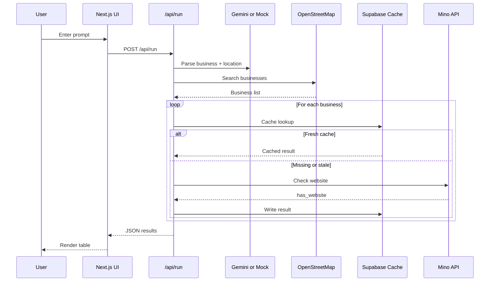
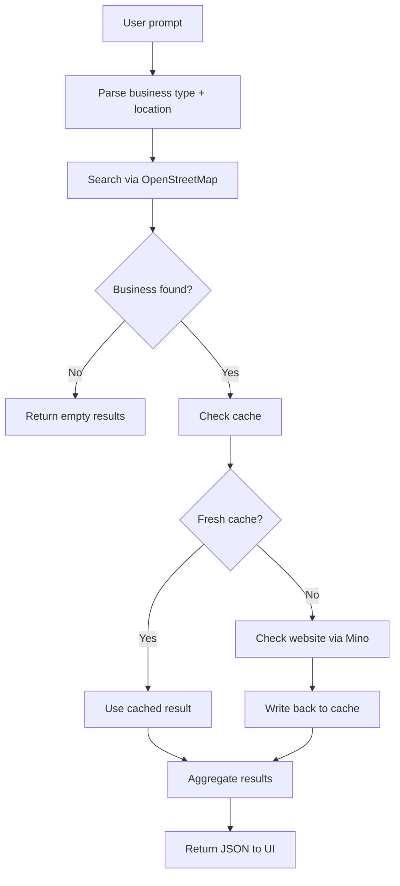
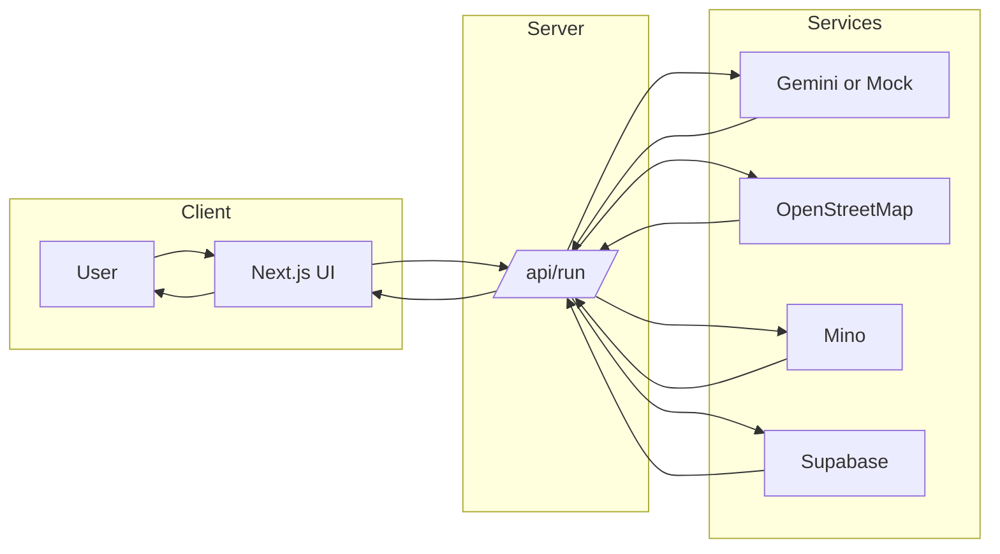
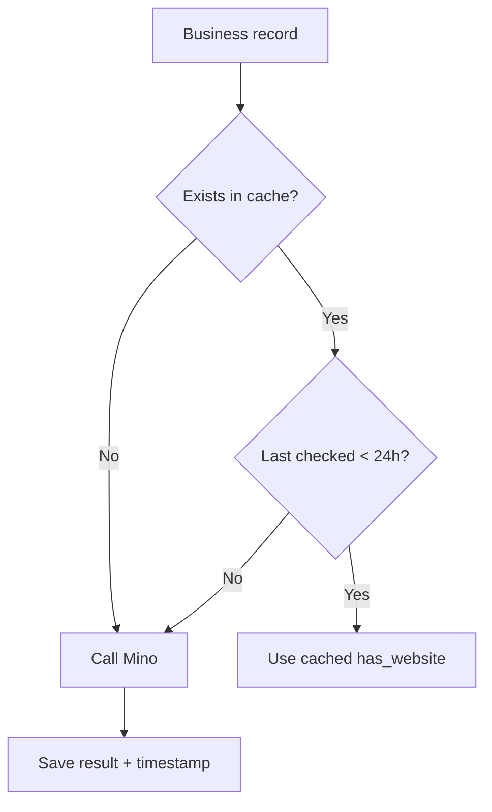

## Full PRD — Business Website Gap Finder

### 1) Overview
**Problem:** Small businesses without websites are hard to identify, so outreach teams waste time searching manually.  
**Solution:** A web app that finds local businesses and flags which ones lack a website.

### 2) Goals
- Let users discover under-digitized local businesses fast.
- Provide a demo-ready workflow with clear, repeatable results.
- Reduce cost and latency with caching.

### 3) Non-Goals
- Full CRM or outreach automation.
- Replacing paid map platforms.
- Perfect accuracy for every website check.

### 4) User Personas
1. **Local marketing agency** — needs outreach lists.  
2. **Business directory owner** — wants to identify gaps.  
3. **Startup founder** — validates a lead-gen workflow.

### 5) Core User Flows
**Flow A: Run a search**
1. User enters a prompt (e.g., "Find salons in Chicago without websites").  
2. App extracts business type + location (Gemini or mock).  
3. OpenStreetMap returns matching businesses.  
4. Mino checks each business for website presence.  
5. Results are shown and cached.

**Flow B: Repeat a search**
1. User runs the same prompt again.  
2. Supabase cache is checked first.  
3. Recent results return quickly without re-checking.

### 6) Functional Requirements
- Prompt input (text area + submit button).
- Loading and error states.
- Summary stats (total businesses + count without websites).
- Results table (name + address + website status).
- Quick prompt buttons for common categories.
- Optional status pills (Gemini, OSM, Cache, Mino).

### 7) Technical Architecture
**Frontend (Next.js App Router):**  
Takes prompt → calls `/api/run` → renders results.

**Backend (Next.js API route):**
1. Extract business type + location (Gemini or mock).  
2. Call OpenStreetMap (Nominatim).  
3. For each business:  
   - Check Supabase cache  
   - If stale or missing → call Mino  
   - Save result back to Supabase  
4. Return formatted JSON.

### 8) System Diagram
```mermaid
flowchart LR
  User[User] --> UI[Next.js UI]
  UI --> API[/api/run]
  API --> Gemini[Gemini or Mock Parser]
  API --> OSM[OpenStreetMap Nominatim]
  API --> Cache[Supabase Cache]
  API --> Mino[Mino API]
  Mino --> API
  Cache --> API
  API --> UI
```

### 9) Request Sequence Diagram


### 10) Search Flowchart


### 11) Swimlane Flow (Roles)


### 12) Cache Decision Flow


### 13) APIs Used
1. **OpenStreetMap (Nominatim)**  
   - Purpose: Find businesses by query  
2. **Mino API**  
   - Purpose: Visit pages and detect website links  
3. **Supabase**  
   - Purpose: Store and reuse results  

### 14) Data & Storage
- **Table:** `businesses`
- **Fields:** `name`, `place_id`, `has_website`, `last_checked_at`
- **Cache rule:** If data is less than 24 hours old, reuse it.

### 15) Error Handling
- Gemini unavailable → fallback to mock parser.  
- OpenStreetMap failure → return empty results with error messaging.  
- Mino failure → mark `has_website = false` and continue.  
- Supabase failure → return results without caching.

### 16) Mocking Strategy (Demo Mode)
- Gemini parsing is mocked to keep demos stable without billing.  
- Location is extracted with a simple heuristic.  
- Default location is applied if none found.

### 17) UI/UX Requirements
- Clear headline explaining the app's purpose.
- Example prompts (US cities + categories).
- Visible "Ready to search" status.
- Friendly empty state and error state messages.
- Results table with readable spacing.

### 18) Success Metrics
- Time to first result < 10 seconds (cached < 3 seconds).
- 80%+ user understanding from the first screen.
- Fewer than 1 error per 20 runs.

### 19) Risks & Mitigations
- **Mino timeouts:** enforce a safe timeout and retries.  
- **False positives:** rely on cache freshness and re-check stale data.  
- **Quota limits:** keep mock mode available for demos.

### 20) Future Improvements
- Enable live Gemini parsing (billing).  
- Add category filters (e.g., "only restaurants").  
- Export CSV.  
- Save searches and histories.

### 21) Links
- **Live App:** https://aaa-new-webapp-chatgpt-cursor.vercel.app  
- **Repo:** https://github.com/Aditya-729/Automated-Detection-of-Google-Maps-Businesses-Without-Websites  
- **Screenshot Placeholder:** `/public/app-screenshot-placeholder.svg`
